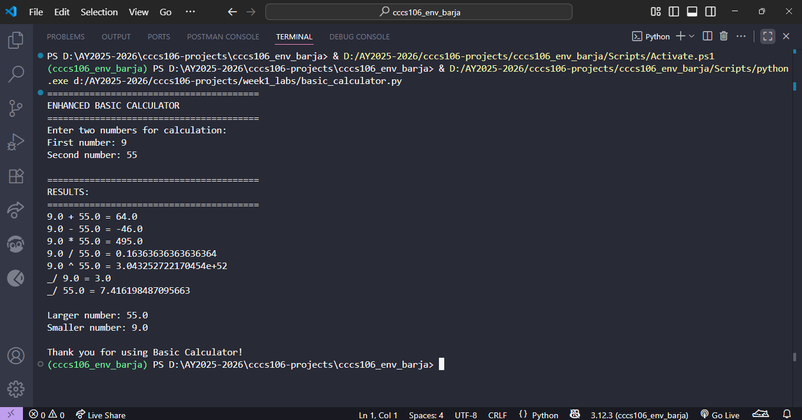
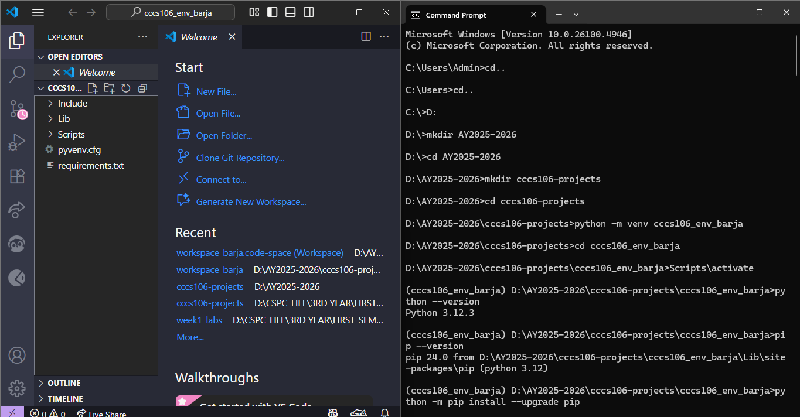
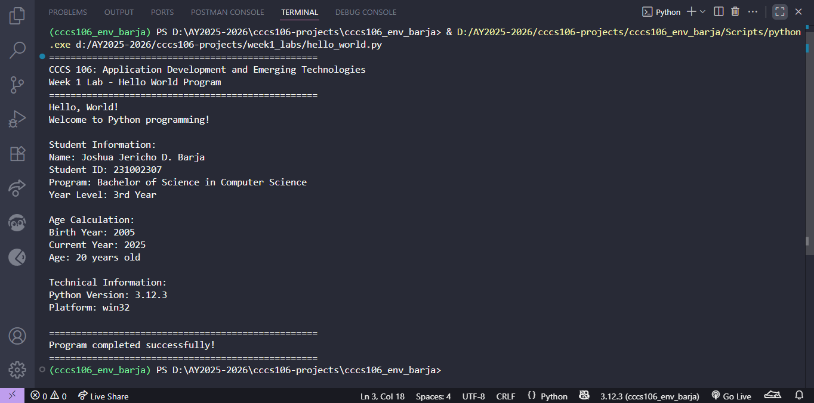
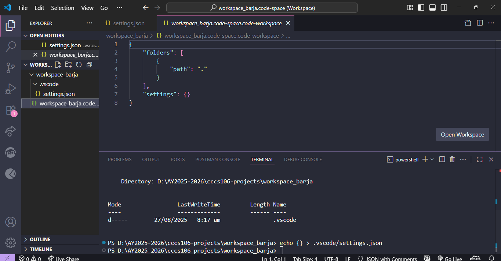
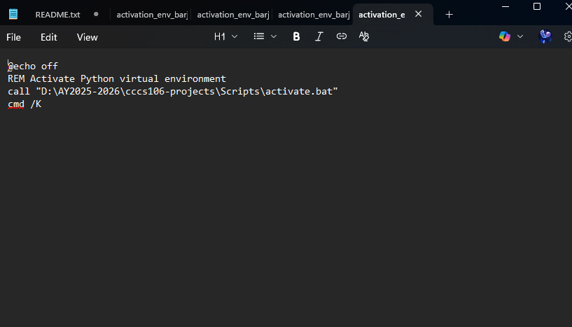

**Student Name:** Joshua Jericho D. Barja
**Student ID:** 231002307
**Section:** BSCS-3A
**Date:** August 27, 2025

## Environment Setup

### Python Installation
- **Python Version:** 3.12.3
- **Installation Issues:** I haven't encountered any installation issues.
- **Virtual Environment Created:** ✅ cccs106_env_barja

### VS Code Configuration
- **VS Code Version:** Version: 1.103.2 (user setup)
- **Python Extension:** ✅ Installed and configured
- **Interpreter:** ✅ Set to cccs106_env_barja/Scripts/python.exe

### Package Installation
- **Flet Version:** 0.28.3
- **Other Packages:** None

## Programs Created

### 1. hello_world.py
- **Status:** ✅ Completed
- **Features:** Student info display, age calculation, system info
- **Notes:** The code ran smoothly.

### 2. basic_calculator.py
- **Status:** ✅ Completed
- **Features:** Basic arithmetic, error handling, min/max calculation
- **Notes:** No issues were present during initial testing.

## Challenges and Solutions

The problem I encountered during the activity was the step 2. The workspace setup was a bit confusing at first since I thought that the workspace should be set up within the created environment. Problems were faced during the creation of the workspace inside the virtutal environment. I later realized that the workspace should be outside the virtual environment because it has its own configuration which might affect the established settings of the venv. 

## Learning Outcomes

I've learned that Python environments are significant because it provides a project with its own encapsulated collection of dependencies, helping to avoid the case where incompatible versions of packages can be required by different projects. Rather than fixing everything worldwide, which can then become noisy or even crash the system Python, a virtual environment makes installations neat and project-specific. This renders projects reproduction-friendly as the precise versions of the packages can be exported and shared in the form of requirements.txt which can be of use when executing the same project on different machines or servers. Virtual environments also turn projects more portable and collaborative with teammates being able to recreate the same on their computers. Due to such advantages, the application of virtual environments can be viewed as a best practice in Python development.

## Screenshots

