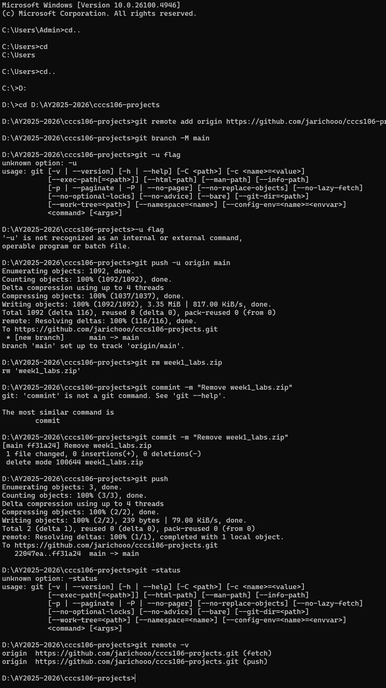
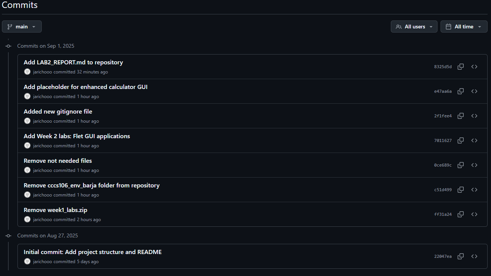
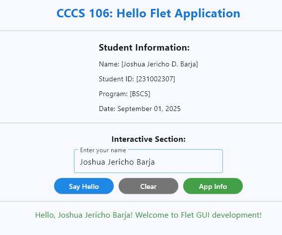
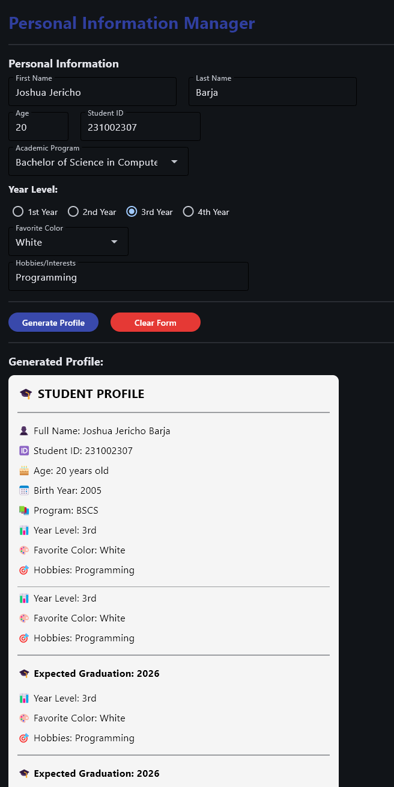

**Student Name:** Joshua Jericho D. Barja
**Student ID:** 231002307
**Section:** BSCS-3A
**Date:** 09-01-2025

## Git Configuration

### Repository Setup
- **GitHub Repository:** https://github.com/jarichooo/cccs106-projects.git
- **Local Repository:** ✅ Initialized and connected
- **Commit History:** 8 commits with descriptive messages

### Git Skills Demonstrated
- ✅ Repository initialization and configuration
- ✅ Adding, committing, and pushing changes
- ✅ Branch creation and merging
- ✅ Remote repository management

## Flet GUI Applications

### 1. hello_flet.py
- **Status:** ✅ Completed
- **Features:** Interactive greeting, student info display, dialog boxes
- **UI Components:** Text, TextField, Buttons, Dialog, Containers
- **Notes:** I haven't experienced any challenges during this part of the exercise.

### 2. personal_info_gui.py
- **Status:** ✅ Completed
- **Features:** Form inputs, dropdowns, radio buttons, profile generation
- **UI Components:** TextField, Dropdown, RadioGroup, Containers, Scrolling
- **Error Handling:** Input validation and user feedback
- **Notes:** The text within the generated profile of the application was almost the same color as its background. I replaced the color of the text to black to make it more visible. Though I experienced a bit of difficulty in doing so, since I'm inexperienced in using Flet for application development, but I was able to pull it off. 

## Technical Skills Developed

### Git Version Control
- Understanding of repository concepts
- Basic Git workflow (add, commit, push)
- Branch management and merging
- Remote repository collaboration

### Flet GUI Development
- Flet 0.28.3 syntax and components
- Page configuration and layout management
- Event handling and user interaction
- Modern UI design principles

## Challenges and Solutions

The usual problem that I experience are files or folders that are mistaken committed or pushed to the repository. So, I have to remove the files and untrack them to remove them properly from the the github repository. I experienced this multiple times because I was so confident with the thought that I'm doing it right.

## Learning Outcomes

I learned that version control, also known as source control, is the practice of tracking and managing changes to software code or repository. Version control systems are software tools that help software teams manage changes to source code over time. As development environments have accelerated, version control systems help software teams work efficiently. They are especially useful for DevOps teams since they help them to reduce development time and increase successful deployments with lesser mistakes.

In GUI development, I realized how much thought goes into designing user-friendly interfaces. Unlike simple console programs, GUI applications require balancing both functionality and user experience. This helped me think not only about the logic behind the code but also how end-users will interact with the system.

Through collaborative programming, I experienced how version control and teamwork go hand in hand. Working on shared repositories during summer taught me about the basics branches, pull requests, and resolving merge conflicts though I'm a bit forgetful. These exercises refreshed me of what I learned before. More importantly, I learned the value of clear communication and documentation when coding with others since it makes it easier to trace development problems with these methods. Programming becomes less about individual effort and more about building together, where each contribution matters.

## Screenshots

### Git Repository
- 
- 
- 

### GUI Applications
- 
- 

## Future Enhancements

I know this might be advanced. But I want to integrate some kind of simple artificial intelligence to the applications to make it stand out. Use an A.I that generates hobbies based on interests, program, age, sex, etc....