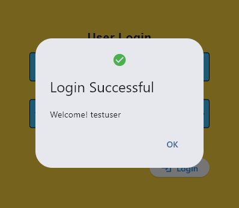
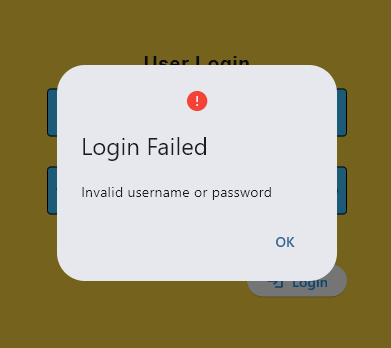
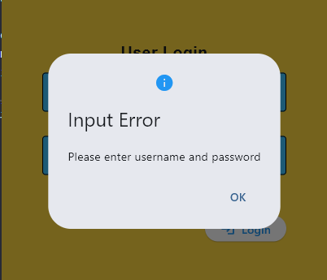
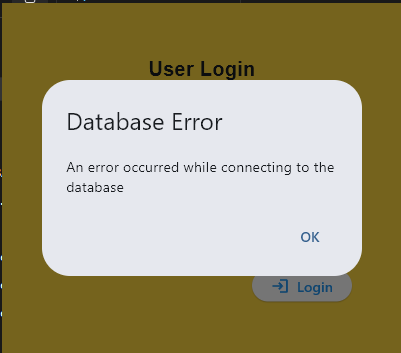

**Student Name:** Joshua Jericho D. Barja
**Student ID:** 231002307
**Section:** BSCS-3A
**Date:** 09-20-2025

## Git Configuration

### Repository Setup
- **GitHub Repository:** https://github.com/jarichooo/cccs106-projects.git
- **Local Repository:** ✅ Initialized and connected
- **Commit History:** 8 commits with descriptive messages

## Flet login form

### 1. main.py
- **Status:** ✅ Completed
- **Features:** logging into local database, prompting specific dialog messages for errors.
- **UI Components:** Text, TextField, Buttons, Dialog, Containers
- **Notes:** I had trouble reading the documentation and its contents, but I was able to pull it off with some help from others and various sources.
## Technical Skills Developed

### Git Version Control

### Flet GUI Development
- Flet 0.28.3 syntax and components
- Page configuration and layout management
- Event handling and user interaction
- Modern UI design principles

## Challenges and Solutions
The problem that I encountered throughout the activity was related to the documentation. There's so much information in a single search. Some functions weren't specific enough.

## Learning Outcomes
I learned how to properly read and utilize a the documentation. And this realization will likely help me with future endeavours all throughout my journey as a programmer. It was quite a challenge at first since I feel like it's a waste reading the flet documentation, but I was wrong. I spent more time debugging codes that I don't know much about rather than knowing how to actually write a code in flet syntax. It was very troublesome since It's quite frustrating that the solutions I've been writing wasn't working right. The documentation solved every bit of my problem. It's quite considerable a life-changing learning for me.
## Screenshots
- 
- 
- 
- 